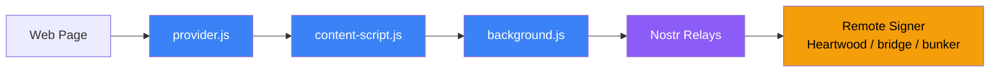

# Bark Architecture

> **This component is part of the [ForgeSworn Identity Stack](https://github.com/forgesworn/heartwood/blob/main/docs/ECOSYSTEM.md).** See the ecosystem overview for how it connects to the other components.

Bark is a browser extension (Manifest V3) that provides the standard
`window.nostr` API. It holds no private keys. Every operation is forwarded over
NIP-46 to a remote signer -- typically a Heartwood appliance, Heartwood daemon,
or Heartwood bridge, but any NIP-46 bunker works.

## Architecture overview

Five components, two security boundaries.



## Message passing chain

The critical path from web page to hardware signer. Five hops, each with a distinct security boundary. For Wi-Fi-less hardware, the remote signer hop is a host daemon such as `heartwood-bridge`; the final hardware hop is USB/serial and remains outside Bark.


**provider.js** is injected into every page at `document_start`. It creates the `window.nostr` object and posts messages with a unique numeric ID and 60-second timeout.

**content-script.js** bridges the page and extension contexts. Validates origin, method, and ID. Retries if the service worker is asleep (MV3 lifecycle). Detects extension updates and notifies the page.

**background.js** is the MV3 service worker. Maintains the NIP-46 connection via nostr-tools' `BunkerSigner`, evaluates policies, manages approval popups, and dispatches requests.

## Policy system

Bark evaluates policies in priority order. The first matching rule wins:

1. Site-specific kind rule (e.g. kind 0 at example.com)
2. Site-specific method deny
3. Global kind rule
4. Site-specific method default
5. Global method default
6. Fallback: deny

Default policies use first-use approval for unknown sites. When the user trusts
a site from the approval popup, routine methods are allowed for that origin, but
protected event kinds still ask unless the user adds a site-specific kind
override.

| Method | Default | Reason |
|--------|---------|--------|
| `getPublicKey` | ask | Links a site to the user's identity |
| `getRelays` | ask | Shares relay preferences |
| `signEvent` | ask | Unknown sites must be trusted first |
| `signEvent` (kind 0) | ask | Profile metadata |
| `signEvent` (kind 3) | ask | Contact list |
| `signEvent` (kind 10002) | ask | Relay list |
| `nip04.encrypt/decrypt` | ask | Legacy private-message operations |
| `nip44.encrypt/decrypt` | ask | Private-message operations |

## Multi-instance support

Bark supports multiple bunker connections. Each instance stores:

```
{
  id: "heartwood-a1b2c3d4",
  name: "heartwood",
  address: "heartwood.local:3000",  // HTTP pairing address
  bunkerUri: "bunker://...",
  clientSecret: "hex64",       // Auth credential, not a signing key
  npub: "npub1...",
  signingPubkey: "",           // Last verified signer pubkey
  heartwoodBaseName: "heartwood",
  heartwoodIdentityLabel: "master",
  heartwoodIdentityPubkey: "hex64",
  isHeartwood: true
}
```

Users switch between instances in the popup. Only one is active at a time.

For current Heartwood builds, each identity is represented by its own bunker
URI. Bark treats those URIs as separate instances rather than relying on a
global active identity inside the signer.

## Heartwood detection

After connecting, Bark probes for Heartwood extensions:

1. Send `heartwood_list_identities` RPC
2. **Success:** Heartwood mode -- enable persona switching, derivation UI
3. **"not approved" error:** Heartwood detected, needs client approval on device
4. **"unknown method" error:** Standard NIP-46 bunker -- disable Heartwood features

Graceful degradation: Bark works with any NIP-46 bunker. Heartwood features are additive.

## HTTP pairing

For local Heartwood devices or host daemons, users can enter
`heartwood.local:3000` instead of a bunker URI:

1. Bark POSTs to `{address}/api/pair` with client pubkey
2. Heartwood approves the Bark client and returns the master bunker URI
3. Bark GETs `{address}/api/identities`
4. Bark imports each per-identity bunker URI as a selectable instance
5. If `/api/identities` is unavailable, Bark falls back to the master URI

Sapwood remains the management surface for creating approved client slots. A
Sapwood-created `bunker://` URI can be pasted directly into Bark; Heartwood HTTP
pairing imports the bunker manifest Heartwood exposes for the same identities.

For the low-cost HSM tier, `heartwood-bridge` is the relay-to-serial daemon. It
connects to relays, forwards encrypted NIP-46 requests to the USB-tethered
device, and republishes the device-signed response. Bark still only sees the
same `bunker://` URI and NIP-46 relays; those relays can be public `wss://`
URLs or loopback `ws://localhost`/`ws://127.0.0.1` URLs exposed by the host
daemon. Bark never speaks serial/WebUSB and does not need to know whether the
target key lives in software Heartwood, Wi-Fi firmware, or a Wi-Fi-less board
behind the bridge.

## Browser targets

The source tree builds one extension codebase into browser-specific outputs:

| Target | Output | Notes |
|--------|--------|-------|
| Chromium, Chrome, Brave, Edge | `dist/` | Manifest V3 service worker |
| Firefox | `dist-firefox/` | Manifest V3 background scripts/event page |
| Safari | `dist-safari/` | Manifest V3 service worker output for Safari Web Extension conversion |

`npm run build:all` and `npm run package:all` produce all variants.

## Auto-reconnect

MV3 service workers die after ~30 seconds of inactivity, killing WebSocket connections. Bark reconnects with exponential backoff:

| Attempt | Delay |
|---------|-------|
| 1 | 5 seconds |
| 2 | 10 seconds |
| 3 | 30 seconds |
| 4+ | 60 seconds |

## Security model

**Zero key storage.** Bark never sees or stores private keys. It holds only:
- Bunker URI (public connection string)
- Client secret (auth credential for NIP-46, not a signing key)
- Relay URLs
- Policy preferences

**Error sanitisation.** Only safe error messages pass to web pages. Internal relay URLs, crypto details, and stack traces are replaced with generic messages.

**Stale detection.** If the extension reloads during a request (Chrome update, manual reload), the content script detects the invalidated context and shows a banner prompting the user to refresh the page.

## Integration points

- **[Heartwood](https://github.com/forgesworn/heartwood):** Remote signer and bridge host. Bark sends NIP-46 requests, receives signatures, and uses Heartwood RPC extensions for persona management when available.
- **[nsec-tree](https://github.com/forgesworn/nsec-tree):** Conceptual dependency. Bark's persona UI maps to nsec-tree's derivation model (personas, groups, indices). No direct code dependency.
- **[ForgeSworn Identity Stack](https://github.com/forgesworn/heartwood/blob/main/docs/ECOSYSTEM.md):** Bark is the browser-facing layer of the signing stack.
